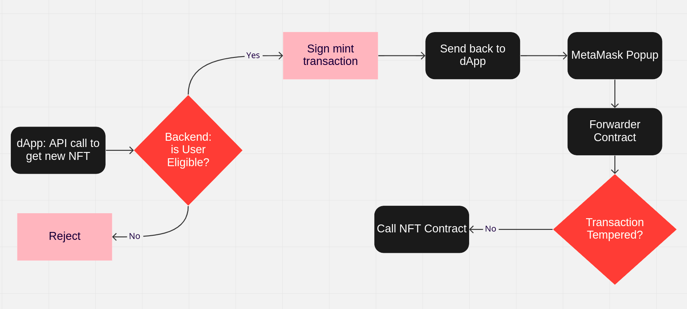

#### Gasless Mint Flow




Clone this project

`git clone https://github.com/ateeqdev/meta-tx`

Change directory

`cd meta-tx`

Install dependencies

`npm i --save-dev`

Update the .env file and add the following

```
PRIVATE_KEY=<private-key  of  your  test  account>

AVAXFUJI_RPC=https://api.avax-test.network/ext/bc/C/rpc

SNOWTRACE_API_KEY=<Your  snowtrace.io  API  key>
```

Get Testnet funds from a [faucet](https://faucet.avax.network/)

Run test cases to ensure the contract code is valid

`npx hardhat test --show-stack-traces`

Deploy contracts

`npx hardhat run scripts/deploy.js --network AVAXFUJI --show-stack-traces`

Verify Contracts

`./scripts/verify.sh`

Run Backend Server

`node server.js`

Run React App (in a new terminal window)

`npm start`